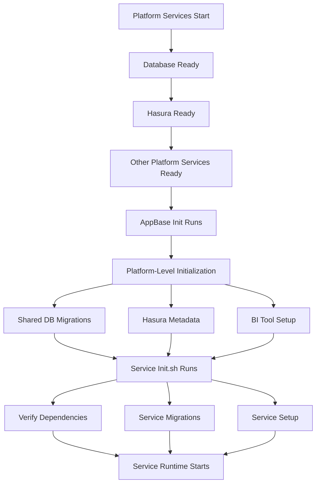

# Adding New Services to the App Layer

## Overview

This guide provides step-by-step instructions for adding a new service to the `app/` layer of the 99x Data Platform. We'll use a NestJS service as a practical example that depends on platform services (database and Hasura).

**Key Concept**: Each service should have its own `init.sh` script that:
- Verifies required platform services are running
- Executes service-specific database migrations
- Performs other service-level initialization
- Runs before the main service starts

## Table of Contents

1. [Architecture Overview](#architecture-overview)
2. [Prerequisites](#prerequisites)
3. [Step-by-Step Implementation](#step-by-step-implementation)
4. [Service Initialization Scripts (init.sh)](#service-initialization-scripts-initsh)
5. [Service Configuration](#service-configuration)
6. [Docker Setup](#docker-setup)
7. [Environment Variables](#environment-variables)
8. [Network Configuration](#network-configuration)
9. [Startup Script Integration](#startup-script-integration)
10. [Testing and Validation](#testing-and-validation)
11. [Troubleshooting](#troubleshooting)

---

## Architecture Overview

The platform uses a two-layer architecture:
- **Platform Layer** (`platform/`): Core infrastructure (database, Hasura, BI tools, Dagster)
- **Application Layer** (`app/`): Business logic services

### Initialization Hierarchy

The platform follows a clear initialization sequence:



**Initialization Flow:**
1. **Platform Initialization**: Platform services start and become ready
2. **AppBase Init** (`appbase-init`): One-time platform-level initialization (shared database migrations, Hasura metadata, BI tool setup)
3. **Service Init** (`init.sh`): Service-specific initialization (service migrations, dependency verification)
4. **Service Runtime**: Main service application starts

### Service Requirements

New app services must:
- Connect to platform services via the `app-base-network` external network
- Use Docker service names for service discovery (e.g., `db`, `hasura`)
- Be configured in `service.yaml` for enablement control
- Implement `init.sh` for service-specific initialization
- Follow the established patterns for health checks, logging, and dependencies

### Separation of Concerns

- **appbase-init**: Handles platform-level initialization (shared schemas, Hasura metadata, BI tool setup)
- **Service init.sh**: Handles service-specific initialization (service tables, service migrations, service dependencies)

---

## Prerequisites

Before adding a new service, ensure you have:

- Understanding of Docker and Docker Compose
- Basic knowledge of the platform architecture (see [AGENTS.md](../AGENTS.md))
- Access to the project repository
- Docker and Docker Compose installed
- Understanding of bash scripting for init scripts
- Familiarity with Flyway for database migrations (if your service needs migrations)

---

## Step-by-Step Implementation

### Step 1: Create Service Directory Structure

Create the service directory under `app/`:

```
app/
└── your-service-name/
    ├── src/              # Service source code
    ├── migrations/       # Service-specific database migrations (Flyway format)
    ├── scripts/          # Service scripts
    │   ├── init.sh       # Service initialization script (REQUIRED)
    │   └── wait-for/     # wait-for.sh utility (copy from appbase-init)
    ├── Dockerfile        # Service-specific Dockerfile
    ├── package.json      # Dependencies (if Node.js/TypeScript)
    └── ...               # Other service files
```

**Example for NestJS:**
```
app/
└── nestjs-service/
    ├── src/
    │   ├── main.ts
    │   ├── app.module.ts
    │   └── ...
    ├── migrations/
    │   ├── V1__create_service_tables.sql
    │   ├── V2__add_service_indexes.sql
    │   └── ...
    ├── scripts/
    │   ├── init.sh
    │   └── wait-for/
    │       └── wait-for.sh
    ├── Dockerfile
    ├── package.json
    ├── tsconfig.json
    └── nest-cli.json
```

---

## Service Initialization Scripts (init.sh)

### Overview

Every service should have an `init.sh` script that runs before the main service starts. This script is responsible for:

1. **Dependency Verification**: Verify required platform services are running and healthy
2. **Service Migrations**: Run service-specific database migrations (separate from appbase-init migrations)
3. **Service Setup**: Perform any other service-specific initialization

### Why init.sh is Important

- **Dependency Management**: Ensures all required platform services are ready before your service starts
- **Service Isolation**: Each service manages its own initialization, keeping concerns separated
- **Migration Management**: Service-specific migrations are separate from platform-level migrations
- **Reliability**: Proper initialization reduces startup failures and runtime errors

### Creating init.sh

**Basic Structure:**
```bash
#!/bin/bash

# ============================================================================
# Service Initialization Script
# ============================================================================
# This script initializes the service before the main application starts.
# 
# Responsibilities:
# 1. Verify required platform services are running
# 2. Execute service-specific database migrations
# 3. Perform other service-level initialization
# ============================================================================

set -eo pipefail

# Helper function to fail on error
fail() {
    if [ $? -ne 0 ]; then
        echo "ERROR: $1"
        exit 1
    fi
}

# Step 1: Wait for database
echo "Waiting for database to be ready..."
./scripts/wait-for/wait-for.sh "${DB_HOST}:${DB_PORT}" -t 60
fail "Timed out waiting for database"

# Step 2: Verify database connection
echo "Verifying database connection..."
PGPASSWORD="${DB_PASSWORD}" psql -h "${DB_HOST}" -p "${DB_PORT}" -U "${DB_USER}" -d "${DB_NAME}" -c "SELECT 1;" > /dev/null
fail "Failed to connect to database"

# Step 3: Wait for Hasura (if required)
if [ -n "${HASURA_URL}" ]; then
    echo "Waiting for Hasura to be ready..."
    ./scripts/wait-for/wait-for.sh "${HASURA_URL}/healthz" -t 120
    fail "Timed out waiting for Hasura"
    
    echo "Verifying Hasura connection..."
    curl -f -H "x-hasura-admin-secret: ${HASURA_GRAPHQL_ADMIN_SECRET}" \
        "${HASURA_URL}/v1/version" > /dev/null
    fail "Failed to connect to Hasura"
fi

# Step 4: Run service-specific migrations
if [ -d "/app/migrations" ] && [ "$(ls -A /app/migrations)" ]; then
    echo "Running service-specific database migrations..."
    flyway \
        -locations="filesystem:/app/migrations" \
        -url="jdbc:postgresql://${DB_HOST}:${DB_PORT}/${DB_NAME}" \
        -user="${DB_USER}" \
        -password="${DB_PASSWORD}" \
        migrate
    fail "Service migrations failed"
else
    echo "No service migrations found, skipping..."
fi

# Step 5: Additional service initialization
echo "Performing additional service initialization..."
# Add your service-specific initialization here
# Example: Seed data, create indexes, etc.

echo "Service initialization completed successfully"
```

### Dependency Verification Patterns

#### Database Verification

```bash
# Wait for database port
./scripts/wait-for/wait-for.sh "${DB_HOST}:${DB_PORT}" -t 60

# Verify connection with query
PGPASSWORD="${DB_PASSWORD}" psql -h "${DB_HOST}" -p "${DB_PORT}" -U "${DB_USER}" -d "${DB_NAME}" -c "SELECT 1;"
```

**Key Points:**
- Use Docker service name `db` (not `localhost`) when connecting from within containers
- Set appropriate timeout based on your database startup time
- Always verify connection with a test query, not just port availability

#### Hasura Verification

```bash
# Wait for Hasura health endpoint
./scripts/wait-for/wait-for.sh "${HASURA_URL}/healthz" -t 120

# Verify Hasura API
curl -f -H "x-hasura-admin-secret: ${HASURA_GRAPHQL_ADMIN_SECRET}" \
    "${HASURA_URL}/v1/version"
```

**Key Points:**
- Hasura may take longer to start than the database
- Use the `/healthz` endpoint for readiness checks
- Verify API access with a simple GraphQL query or version check

#### Other Platform Services

```bash
# Metabase
./scripts/wait-for/wait-for.sh "${METABASE_URL}/api/health" -t 120

# Superset
./scripts/wait-for/wait-for.sh "${SUPERSET_URL}/health" -t 120

# Dagster
./scripts/wait-for/wait-for.sh "${DAGSTER_URL}/health" -t 120
```

### Service-Specific Migrations

#### Migration Directory Structure

```
migrations/
├── V1__create_service_tables.sql
├── V2__add_service_indexes.sql
├── V3__add_service_foreign_keys.sql
└── ...
```

**Flyway Naming Convention:**
- Format: `V{version}__{description}.sql`
- Version must be numeric (e.g., `V1`, `V2`, `V10`)
- Description uses double underscores `__` as separator
- Use descriptive names: `V1__create_user_tables.sql`

#### Database Table Naming Convention

**IMPORTANT**: Use service name prefix for all database tables created by your service.

**Convention:**
- Format: `{service_name}_{table_name}`
- Use lowercase with underscores
- Service name should be short and descriptive

**Examples:**
- Service: `nestjs-service` → Tables: `nestjs_users`, `nestjs_config`, `nestjs_logs`
- Service: `auth-service` → Tables: `auth_sessions`, `auth_tokens`, `auth_permissions`
- Service: `notification-service` → Tables: `notification_messages`, `notification_subscriptions`

**Why this matters:**
- **Easy Identification**: Quickly identify all tables belonging to a service
- **Simple Backup**: Backup all service tables with pattern matching: `pg_dump -t service_name_*`
- **Clean Removal**: Easily find and remove service tables when removing the service
- **Namespace Isolation**: Prevents naming conflicts with other services
- **Documentation**: Table names self-document which service owns them

**Migration Example with Naming Convention:**
```sql
-- V1__create_service_tables.sql
-- Service: nestjs-service
-- All tables use 'nestjs_' prefix

CREATE TABLE IF NOT EXISTS nestjs_users (
    id SERIAL PRIMARY KEY,
    username VARCHAR(255) NOT NULL UNIQUE,
    email VARCHAR(255) NOT NULL,
    created_at TIMESTAMP DEFAULT CURRENT_TIMESTAMP
);

CREATE TABLE IF NOT EXISTS nestjs_config (
    id SERIAL PRIMARY KEY,
    key VARCHAR(255) NOT NULL UNIQUE,
    value TEXT,
    updated_at TIMESTAMP DEFAULT CURRENT_TIMESTAMP
);

CREATE INDEX IF NOT EXISTS idx_nestjs_users_email ON nestjs_users(email);
CREATE INDEX IF NOT EXISTS idx_nestjs_config_key ON nestjs_config(key);
```

#### Running Migrations

```bash
# Using Flyway (same as appbase-init)
flyway \
    -locations="filesystem:/app/migrations" \
    -url="jdbc:postgresql://${DB_HOST}:${DB_PORT}/${DB_NAME}" \
    -user="${DB_USER}" \
    -password="${DB_PASSWORD}" \
    migrate
```

**Important Notes:**
- Service migrations run in the service's own database schema or tables
- Use Flyway naming convention: `V{version}__{description}.sql`
- **Use service name prefix for all tables**: `{service_name}_{table_name}` (e.g., `nestjs_users`, `auth_sessions`)
- Migrations are idempotent (Flyway tracks applied migrations)
- Service migrations are separate from appbase-init migrations
- Flyway creates a `flyway_schema_history` table to track applied migrations
- Table naming convention enables easy backup and removal: `pg_dump -t service_name_*`

#### Example Migration File

```sql
-- V1__create_service_tables.sql
-- Service: nestjs-service
-- IMPORTANT: All tables use 'nestjs_' prefix for easy identification and cleanup

CREATE TABLE IF NOT EXISTS nestjs_users (
    id SERIAL PRIMARY KEY,
    username VARCHAR(255) NOT NULL UNIQUE,
    email VARCHAR(255) NOT NULL,
    created_at TIMESTAMP DEFAULT CURRENT_TIMESTAMP
);

CREATE TABLE IF NOT EXISTS nestjs_config (
    id SERIAL PRIMARY KEY,
    key VARCHAR(255) NOT NULL UNIQUE,
    value TEXT,
    updated_at TIMESTAMP DEFAULT CURRENT_TIMESTAMP
);

CREATE INDEX IF NOT EXISTS idx_nestjs_users_email ON nestjs_users(email);
CREATE INDEX IF NOT EXISTS idx_nestjs_config_key ON nestjs_config(key);
```

**Key Points:**
- All tables use the service name prefix (`nestjs_` in this example)
- Indexes also use the service prefix for consistency
- This makes it easy to identify, backup, and remove service tables later

### Complete NestJS init.sh Example

Here's a complete, production-ready `init.sh` script for a NestJS service:

```bash
#!/bin/bash

# ============================================================================
# NestJS Service Initialization Script
# ============================================================================

set -eo pipefail

echo "=================================================="
echo "NestJS Service Initialization"
echo "=================================================="

# Helper function
fail() {
    if [ $? -ne 0 ]; then
        echo "ERROR: $1"
        exit 1
    fi
}

# Database connection variables
DB_HOST=${DB_HOST:-db}
DB_PORT=${DB_PORT:-5432}
DB_USER=${DB_USER}
DB_PASSWORD=${DB_PASSWORD}
DB_NAME=${DB_NAME}

# Hasura connection variables
HASURA_URL=${HASURA_URL:-http://hasura:8080}
HASURA_GRAPHQL_ADMIN_SECRET=${HASURA_GRAPHQL_ADMIN_SECRET}

# Step 1: Wait for database
echo "Step 1: Waiting for database at ${DB_HOST}:${DB_PORT}..."
./scripts/wait-for/wait-for.sh "${DB_HOST}:${DB_PORT}" -t 60
fail "Timed out waiting for database"

# Step 2: Verify database connection
echo "Step 2: Verifying database connection..."
PGPASSWORD="${DB_PASSWORD}" psql -h "${DB_HOST}" -p "${DB_PORT}" -U "${DB_USER}" -d "${DB_NAME}" -c "SELECT 1;" > /dev/null 2>&1
fail "Failed to connect to database ${DB_NAME}"

echo "✓ Database connection verified"

# Step 3: Wait for Hasura
echo "Step 3: Waiting for Hasura at ${HASURA_URL}..."
./scripts/wait-for/wait-for.sh "${HASURA_URL}/healthz" -t 120
fail "Timed out waiting for Hasura"

# Step 4: Verify Hasura connection
echo "Step 4: Verifying Hasura connection..."
curl -f -s -H "x-hasura-admin-secret: ${HASURA_GRAPHQL_ADMIN_SECRET}" \
    "${HASURA_URL}/v1/version" > /dev/null
fail "Failed to connect to Hasura"

echo "✓ Hasura connection verified"

# Step 5: Run service-specific migrations
if [ -d "/app/migrations" ] && [ "$(ls -A /app/migrations 2>/dev/null)" ]; then
    echo "Step 5: Running service-specific database migrations..."
    
    # Check if Flyway is available
    if ! command -v flyway &> /dev/null; then
        echo "WARNING: Flyway not found, skipping migrations"
        echo "         Install Flyway in Dockerfile if migrations are required"
    else
        flyway \
            -locations="filesystem:/app/migrations" \
            -url="jdbc:postgresql://${DB_HOST}:${DB_PORT}/${DB_NAME}" \
            -user="${DB_USER}" \
            -password="${DB_PASSWORD}" \
            migrate
        fail "Service migrations failed"
        echo "✓ Service migrations completed"
    fi
else
    echo "Step 5: No service migrations found, skipping..."
fi

# Step 6: Additional service initialization
echo "Step 6: Performing additional service initialization..."
# Example: Create service-specific indexes, seed data, etc.
# Add your custom initialization logic here

echo "=================================================="
echo "NestJS Service Initialization Completed"
echo "=================================================="
```

### Copying wait-for.sh Utility

The `wait-for.sh` utility is used to wait for services to become available. Copy it from `appbase-init`:

```bash
# From your service directory
cp -r ../appbase-init/init/scripts/wait-for ./scripts/
chmod +x ./scripts/wait-for/wait-for.sh
```

Or include it in your Dockerfile (see Docker Setup section).

---

## Docker Setup

### Creating the Dockerfile

Create a Dockerfile following the multi-stage build pattern. Include Flyway if migrations are needed.

**NestJS Example Dockerfile with init.sh:**
```dockerfile
# Build stage
FROM node:24.11.1-alpine AS builder
WORKDIR /app
COPY package*.json ./
RUN npm ci
COPY . .
RUN npm run build

# Flyway stage (for migrations)
FROM flyway/flyway:latest AS flyway-source

# Runtime stage
FROM node:24.11.1-alpine
WORKDIR /app

# Install system dependencies (postgresql-client for psql, curl for health checks)
RUN apk add --no-cache \
    postgresql-client \
    curl \
    bash

# Copy Flyway from flyway-source
COPY --from=flyway-source /flyway /flyway
RUN chmod +x /flyway/flyway && \
    ln -s /flyway/flyway /usr/local/bin/flyway

# Copy built application
COPY --from=builder /app/dist ./dist
COPY --from=builder /app/node_modules ./node_modules
COPY package*.json ./

# Copy service scripts and migrations
COPY nestjs-service/scripts/ /app/scripts/
COPY nestjs-service/migrations/ /app/migrations/
COPY entrypoint.sh /app/entrypoint.sh

# Make scripts executable
RUN chmod +x /app/scripts/init.sh /app/entrypoint.sh /app/scripts/wait-for/wait-for.sh

EXPOSE 3000

# Use entrypoint that runs init.sh then starts service
ENTRYPOINT ["/app/entrypoint.sh"]
CMD ["node", "dist/main.js"]
```

**Key Points:**
- Use multi-stage builds to minimize image size
- Install `postgresql-client` for `psql` commands in init.sh
- Install `curl` for health checks and API verification
- Copy `wait-for.sh` utility to scripts directory
- Make all scripts executable
- Set proper entrypoint to run init.sh before service starts

### Creating Entrypoint Script

Create `entrypoint.sh` in your service directory:

```bash
#!/bin/bash
set -eo pipefail

echo "=================================================="
echo "Starting NestJS Service"
echo "=================================================="

# Run service initialization
echo "Running service initialization..."
/app/scripts/init.sh

# Start the main service
echo "Starting NestJS application..."
exec "$@"
```

**Key Points:**
- Use `set -eo pipefail` for error handling
- Run `init.sh` before starting the service
- Use `exec "$@"` to start the service (replaces shell process)

### Alternative: Direct init.sh in CMD

If you prefer not to use an entrypoint script, you can call init.sh directly in CMD:

```dockerfile
CMD ["/bin/bash", "-c", "/app/scripts/init.sh && node dist/main.js"]
```

However, the entrypoint approach is recommended for better control and logging.

---

## Service Configuration

### Adding Service to docker-compose.yaml

Add your service to [app/docker-compose.yaml](../app/docker-compose.yaml) following the existing pattern. Ensure it depends on `appbase-init`.

**NestJS Service Example:**
```yaml
services:
  nestjs-service:
    profiles: ["nestjs-service"]
    platform: linux/amd64
    build:
      context: .
      dockerfile: Dockerfile.nestjs-service
    image: appbase/nestjs-service:latest
    container_name: nestjs-service
    restart: unless-stopped
    environment:
      # Database connection
      DB_HOST: ${APPBASE_DB_HOST}
      DB_PORT: ${APPBASE_DB_PORT}
      DB_USER: ${APPBASE_DB_USER}
      DB_PASSWORD: ${APPBASE_DB_PASSWORD}
      DB_NAME: ${APPBASE_DB_NAME}
      
      # Hasura connection
      HASURA_URL: ${HASURA_URL}
      HASURA_GRAPHQL_ADMIN_SECRET: ${HASURA_GRAPHQL_ADMIN_SECRET}
      
      # Application configuration
      NODE_ENV: ${NODE_ENV}
      PORT: 3000
    depends_on:
      appbase-init:
        condition: service_completed_successfully
    ports:
      - "3000:3000"
    healthcheck:
      test: ["CMD-SHELL", "curl -f http://localhost:3000/health || exit 1"]
      interval: 30s
      timeout: 10s
      retries: 3
      start_period: 120s  # Longer start period to allow init.sh to complete
    networks:
      - app-base-network
    logging: *default-logging
```

**Key Points:**
- `depends_on: appbase-init` ensures platform initialization completes first
- `start_period` in healthcheck should account for init.sh execution time (typically 60-120 seconds)
- Use Docker service names in environment variables (`db`, `hasura`)
- Set `platform: linux/amd64` for production compatibility
- Use profile for optional services (mandatory services like `appbase-init` don't use profiles)

### Updating service.yaml

Add your service to [service.yaml](../service.yaml) at the project root:

```yaml
app:
  # appbase-init is mandatory and always runs (not toggleable)
  data-platform-service: true
  nestjs-service: true  # Your new service
```

**Service Configuration Rules:**
- `true`: Service is enabled and will start
- `false`: Service is disabled and will not start
- Service enablement is read by [app/start.sh](../app/start.sh)
- Environment variables are NOT used for service toggling

---

## Environment Variables

### Adding Environment Variables

Add required environment variables to:
- [app/_env_sample](../app/_env_sample) - Template for new setups
- [app/.env](../app/.env) - Your local configuration (gitignored)

**NestJS Service Environment Variables:**
```bash
################################################################################
# NESTJS SERVICE CONFIGURATION
################################################################################
NESTJS_SERVICE_PORT=3000
NESTJS_SERVICE_LOG_LEVEL=info
```

**Connection Variables (Already Defined):**
- Database: `APPBASE_DB_HOST`, `APPBASE_DB_PORT`, `APPBASE_DB_USER`, `APPBASE_DB_PASSWORD`, `APPBASE_DB_NAME`
- Hasura: `HASURA_URL`, `HASURA_GRAPHQL_ADMIN_SECRET`

**Important Notes:**
- Use existing connection variables when possible
- Add service-specific variables only when needed
- Document all variables in `_env_sample`
- Never commit `.env` files to version control

### Development vs Production Mode (APP_MODE)

The platform supports development and production modes for app services using the `APP_MODE` environment variable. This enables hot reload for local development while ensuring production uses optimized built containers.

**APP_MODE Values:**
- `development`: Enables hot reload, mounts source code volumes, uses watch mode
- `production`: Uses built containers, no volume mounts, optimized runtime (default)

**Configuration:**
```bash
# In app/_env_sample and app/.env
APP_MODE=production  # Default for safety
# Set to 'development' for local development with hot reload
```

**How It Works:**

1. **Environment Variable**: Set `APP_MODE` in `app/.env`
2. **Docker Compose**: Always mounts source code volumes (entrypoint decides usage)
3. **Entrypoint Script**: Checks `APP_MODE` and runs appropriate command:
   - `development`: `npm run start:dev` (hot reload)
   - `production`: `node dist/main.js` (built application)

**Example Implementation for NestJS Service:**

**docker-compose.yaml:**
```yaml
services:
  nestjs-service:
    # ... other config ...
    environment:
      APP_MODE: ${APP_MODE:-production}  # Default to production
      # ... other env vars ...
    volumes:
      # Always mount volumes - entrypoint decides based on APP_MODE
      - ./nestjs-service/src:/app/src:delegated
      - ./nestjs-service/package.json:/app/package.json:ro
      - ./nestjs-service/tsconfig.json:/app/tsconfig.json:ro
      - ./nestjs-service/nest-cli.json:/app/nest-cli.json:ro
      - ./nestjs-service/scripts:/app/scripts:ro
```

**entrypoint.sh:**
```bash
#!/bin/bash
set -eo pipefail

# Run service initialization
/app/scripts/init.sh

# Determine mode (default to production for safety)
APP_MODE=${APP_MODE:-production}

# Start based on mode
if [ "${APP_MODE}" = "development" ]; then
    echo "Starting in DEVELOPMENT mode (hot reload enabled)..."
    exec npm run start:dev
else
    echo "Starting in PRODUCTION mode (using built application)..."
    exec node dist/main.js
fi
```

**Benefits:**
- **Development**: Hot reload without rebuilding containers
- **Production**: Optimized performance, no source code exposure
- **Consistent Pattern**: Same approach for all app services
- **Simple**: Single environment variable controls behavior

**Note**: This pattern is currently implemented for `action-handler` service and can be applied to future services following the same approach.

---

## Network Configuration

### Understanding Networks

The platform uses Docker networks for service communication:

- **app-base-network**: External network shared between platform and app services
- Services connect using Docker service names: `db`, `hasura`, `metabase`, etc.
- Port mapping: Map container ports to host ports in `docker-compose.yaml`

### Connection Patterns

**From Container to Platform Services:**
- Database: `postgres://${APPBASE_DB_USER}:${APPBASE_DB_PASSWORD}@db:5432/${APPBASE_DB_NAME}`
- Hasura: `http://hasura:8080`
- Metabase: `http://metabase:3000`
- Superset: `http://superset:8088`

**From Host Machine:**
- Use `localhost` with mapped ports: `http://localhost:8081` (Hasura), `http://localhost:3000` (Metabase)

**Key Points:**
- Always use Docker service names when connecting from within containers
- Use `localhost` only when connecting from the host machine
- Ensure your service is on the `app-base-network` network

---

## Startup Script Integration

### Updating app/start.sh

Update [app/start.sh](../app/start.sh) to handle your new service:

**1. Add Service State Reading:**
```bash
# Read app service states from service.yaml
APP_DATA_PLATFORM_SERVICE=$(get_service_state "app.data-platform-service")
APP_NESTJS_SERVICE=$(get_service_state "app.nestjs-service")  # Add this
```

**2. Add Service Build Logic:**
```bash
# Conditionally build nestjs-service if enabled
if [ "$APP_NESTJS_SERVICE" = "true" ]; then
    print_status "Building nestjs-service (enabled in service.yaml)..."
    DOCKER_BUILDKIT=1 docker compose --profile nestjs-service build $CACHE_OPTION nestjs-service
else
    print_status "nestjs-service disabled in service.yaml, skipping build"
fi
```

**3. Add Profile to Compose Command:**
```bash
# Add profile for nestjs-service if enabled
if [ "$APP_NESTJS_SERVICE" = "true" ]; then
    print_status "Including nestjs-service profile"
    compose_command+=" --profile nestjs-service"
fi
```

**4. Add Service Verification:**
```bash
# Verify nestjs-service if enabled
if [ "$APP_NESTJS_SERVICE" = "true" ]; then
    if docker ps --format "{{.Names}}" | grep -q "^nestjs-service$"; then
        print_success "  ✓ nestjs-service is running"
    else
        print_error "  ✗ ERROR: nestjs-service should be running but is not"
    fi
else
    if docker ps --format "{{.Names}}" | grep -q "^nestjs-service$"; then
        print_warning "  ⚠ WARNING: nestjs-service is running but should be disabled in service.yaml"
    else
        print_success "  ✓ nestjs-service is correctly disabled"
    fi
fi
```

**Reference Implementation:**
See how `data-platform-service` is handled in [app/start.sh](../app/start.sh) for the complete pattern.

### Updating app/stop.sh

Update [app/stop.sh](../app/stop.sh) to handle your new service when stopping:

**1. Add Service State Reading:**
```bash
# Read app service states from service.yaml
APP_DATA_PLATFORM_SERVICE=$(get_service_state "app.data-platform-service")
APP_NESTJS_SERVICE=$(get_service_state "app.nestjs-service")  # Add this
```

**2. Update Service Detection:**
```bash
# Check if application services are running or exist
RUNNING_SERVICES=$(docker ps -a --format "table {{.Names}}" | grep -E "(appbase-init|data-platform-service|nestjs-service)" | wc -l)
```

**3. Add Profile to Compose Command:**
```bash
# Add profile for nestjs-service if enabled
if [ "$APP_NESTJS_SERVICE" = "true" ]; then
    print_status "Including nestjs-service profile for shutdown"
    compose_command+=" --profile nestjs-service"
fi
```

**4. Add Service Status Output:**
```bash
if [ "$APP_NESTJS_SERVICE" = "true" ]; then
    print_status "  - nestjs-service: NestJS Service"
fi
```

**Complete Example:**
```bash
# Read app service states from service.yaml
APP_DATA_PLATFORM_SERVICE=$(get_service_state "app.data-platform-service")
APP_NESTJS_SERVICE=$(get_service_state "app.nestjs-service")
PLATFORM_DAGSTER=$(get_service_state "platform.dagster")

# Check if application services are running or exist
RUNNING_SERVICES=$(docker ps -a --format "table {{.Names}}" | grep -E "(appbase-init|data-platform-service|nestjs-service)" | wc -l)

# Build docker compose command with appropriate profiles
compose_command="docker compose"

# Always stop appbase-init (mandatory, no profile needed)
# Add profile for data-platform-service if enabled
if [ "$APP_DATA_PLATFORM_SERVICE" = "true" ]; then
    print_status "Including data-platform-service profile for shutdown"
    compose_command+=" --profile data-platform-service"
fi

# Add profile for nestjs-service if enabled
if [ "$APP_NESTJS_SERVICE" = "true" ]; then
    print_status "Including nestjs-service profile for shutdown"
    compose_command+=" --profile nestjs-service"
fi

# Stop the application compose
$compose_command down

# Display stopped services
if [ "$APP_NESTJS_SERVICE" = "true" ]; then
    print_status "  - nestjs-service: NestJS Service"
fi
```

**Reference Implementation:**
See how `action-handler` is handled in [app/stop.sh](../app/stop.sh) for the complete pattern.

---

## Testing and Validation

### 1. Test init.sh Script

```bash
# Build the service
cd app
docker compose --profile nestjs-service build nestjs-service

# Run init.sh manually (for debugging)
docker run --rm \
  --network app-base-network \
  -e DB_HOST=db \
  -e DB_PORT=5432 \
  -e DB_USER=${APPBASE_DB_USER} \
  -e DB_PASSWORD=${APPBASE_DB_PASSWORD} \
  -e DB_NAME=${APPBASE_DB_NAME} \
  -e HASURA_URL=http://hasura:8080 \
  -e HASURA_GRAPHQL_ADMIN_SECRET=${HASURA_GRAPHQL_ADMIN_SECRET} \
  appbase/nestjs-service:latest \
  /app/scripts/init.sh
```

### 2. Verify Service Startup

```bash
# Start the service
cd app
./start.sh

# Check service logs (should show init.sh output)
docker compose logs -f nestjs-service

# Verify init.sh completed
docker compose logs nestjs-service | grep "Service initialization completed"
```

### 3. Test Migrations

```bash
# Check if migrations were applied
docker exec -it nestjs-service psql -h db -U ${APPBASE_DB_USER} -d ${APPBASE_DB_NAME} -c "\dt"

# Check Flyway schema history
docker exec -it nestjs-service psql -h db -U ${APPBASE_DB_USER} -d ${APPBASE_DB_NAME} -c "SELECT * FROM flyway_schema_history;"
```

### 4. Test Service Health

```bash
# Test health endpoint
curl http://localhost:3000/health

# Check service status
docker compose ps nestjs-service
```

### 5. Test Database Connection

```bash
# From within the service container
docker exec -it nestjs-service sh
# Test database connection from your service code
```

### 6. Test Hasura Connection

```bash
# Verify Hasura is accessible
curl -H "x-hasura-admin-secret: ${HASURA_GRAPHQL_ADMIN_SECRET}" \
  http://localhost:8081/v1/graphql
```

### 7. Verify Network Connectivity

```bash
# From within your service container
docker exec -it nestjs-service sh
# Test connectivity to platform services
ping db
ping hasura
curl http://hasura:8080/healthz
```

### 8. Security Vulnerability Scanning (MANDATORY)

**IMPORTANT**: All new service images MUST be scanned for security vulnerabilities using Docker Scout before deployment. This is a mandatory step.

**Security Targets:**
- **Critical Vulnerabilities:** 0 (MUST)
- **High Vulnerabilities:** 0 (MUST)
- **Medium Vulnerabilities:** < 5 per image (TARGET)

**Scan the Service Image:**

```bash
# Build the service image first (if not already built)
cd app
docker compose --profile nestjs-service build nestjs-service

# Scan for Critical and High vulnerabilities (MANDATORY)
docker scout cves appbase/nestjs-service:latest --only-severity critical,high

# Scan for all vulnerabilities including Medium (for full assessment)
docker scout cves appbase/nestjs-service:latest --only-severity critical,high,medium

# Get remediation recommendations
docker scout recommendations appbase/nestjs-service:latest
```

**Expected Results:**
- ✅ **0 Critical vulnerabilities** - Required
- ✅ **0 High vulnerabilities** - Required
- ✅ **< 5 Medium vulnerabilities** - Target (some may be unfixable base OS packages)

**If Vulnerabilities Are Found:**

1. **Critical or High Vulnerabilities Found:**
   - **MUST FIX** before deployment
   - Review Docker Scout recommendations: `docker scout recommendations appbase/nestjs-service:latest`
   - Update base image or dependencies
   - Rebuild and rescan until 0 Critical and 0 High are achieved

2. **Medium Vulnerabilities:**
   - Review each vulnerability
   - Fix if possible (update packages, use overrides, etc.)
   - Document unfixable vulnerabilities (base OS packages, dependency conflicts)
   - Target: < 5 Medium vulnerabilities per image

**Remediation Steps:**

```bash
# After fixing vulnerabilities, rebuild
docker compose --profile nestjs-service build --no-cache nestjs-service

# Rescan to verify fixes
docker scout cves appbase/nestjs-service:latest --only-severity critical,high,medium

# Compare with previous scan (if you have a baseline)
docker scout compare appbase/nestjs-service:old appbase/nestjs-service:latest
```

**Common Remediation Strategies:**

1. **Update Base Image:**
   ```dockerfile
   # Update to latest LTS version
   FROM node:24.11.1-alpine  # Use specific version
   ```

2. **Update Dependencies:**
   ```bash
   # Update package.json dependencies
   npm audit fix
   npm update
   ```

3. **Use Package Overrides (Node.js):**
   ```json
   // package.json
   {
     "overrides": {
       "glob": "11.1.0",  // Force fixed version
       "tar": "7.5.2"     // Force fixed version
     }
   }
   ```

4. **Use Multi-stage Builds:**
   - Minimize attack surface
   - Remove build tools from final image
   - Only include runtime dependencies

5. **Pin Dependency Versions:**
   - Use exact versions in requirements.txt or package.json
   - Avoid wildcard versions (`*`, `^`, `~`)

**Verification After Remediation:**

```bash
# Final scan to confirm compliance
docker scout cves appbase/nestjs-service:latest --only-severity critical,high,medium

# Verify targets are met
# Expected: 0 Critical, 0 High, < 5 Medium
```

**Documentation Requirements:**

If vulnerabilities cannot be fixed (unfixable base OS packages, dependency conflicts), document them:
- Create a security assessment document
- Explain why vulnerabilities cannot be fixed
- Document any runtime mitigations
- Reference similar patterns from existing services (see [container-security-posture-report.md](container-security-posture-report.md))

**Reference:**
- See [container-security-posture-report.md](container-security-posture-report.md) for security standards and examples
- See [container-image-hardening-prd.md](container-image-hardening-prd.md) for hardening strategies

---

## Troubleshooting

### init.sh Fails

**Check:**
1. Script is executable: `chmod +x scripts/init.sh`
2. wait-for.sh is present and executable
3. Environment variables are set correctly
4. Platform services are running
5. Network connectivity: `docker exec -it nestjs-service ping db`

**Debug:**
```bash
# Run init.sh with verbose output
docker exec -it nestjs-service /bin/bash
cd /app
bash -x scripts/init.sh
```

**Common Issues:**
- **Permission denied**: Ensure scripts are executable (`chmod +x`)
- **wait-for.sh not found**: Copy wait-for.sh to scripts directory
- **Database connection failed**: Check environment variables and network connectivity
- **Timeout waiting for service**: Increase timeout value in wait-for.sh call

### Migrations Fail

**Check:**
1. Flyway is installed in Dockerfile
2. Migration files are in correct format: `V{version}__{description}.sql`
3. Database connection is correct
4. User has CREATE/ALTER permissions

**Debug:**
```bash
# Test Flyway manually
docker exec -it nestjs-service flyway \
    -locations="filesystem:/app/migrations" \
    -url="jdbc:postgresql://db:5432/${DB_NAME}" \
    -user="${DB_USER}" \
    -password="${DB_PASSWORD}" \
    info
```

**Common Issues:**
- **Flyway not found**: Install Flyway in Dockerfile (see Docker Setup section)
- **Invalid migration name**: Use format `V{version}__{description}.sql`
- **Permission denied**: Ensure database user has CREATE/ALTER permissions
- **Migration already applied**: Flyway tracks applied migrations, won't re-apply

### Service Won't Start

**Check:**
1. Service enabled in `service.yaml`?
2. Profile included in startup command?
3. Environment variables set in `.env`?
4. Platform services running?
5. Network `app-base-network` exists?

**Commands:**
```bash
# Check service.yaml
cat service.yaml | grep -A 5 "app:"

# Check if network exists
docker network ls | grep app-base-network

# Check platform services
cd ../platform && docker compose ps
```

### Connection Issues

**Database Connection:**
- Verify `APPBASE_DB_HOST` is `db` (Docker service name, not `localhost`)
- Check database credentials in `.env`
- Ensure database is healthy: `docker compose -f ../platform/docker-compose.yaml ps db`

**Hasura Connection:**
- Verify `HASURA_URL` is `http://hasura:8080` (Docker service name)
- Check Hasura is running: `curl http://localhost:8081/healthz`
- Verify admin secret matches

**Network Issues:**
- Ensure service is on `app-base-network`
- Test connectivity: `docker exec -it nestjs-service ping db`
- Check network: `docker network inspect app-base-network`

### Build Issues

**Dockerfile Problems:**
- Verify `platform: linux/amd64` in docker-compose.yaml
- Check build context is correct
- Ensure all dependencies are in Dockerfile

**Multi-stage Build:**
- Verify builder stage copies all necessary files
- Check runtime stage has all required dependencies
- Ensure proper file permissions

### Security Vulnerabilities Found

**Symptoms:**
- Docker Scout reports Critical or High vulnerabilities
- Service fails security compliance check
- Cannot deploy due to security policy

**Solutions:**

1. **Critical or High Vulnerabilities:**
   ```bash
   # Get remediation recommendations
   docker scout recommendations appbase/your-service-name:latest
   
   # Common fixes:
   # - Update base image to latest LTS version
   # - Update dependencies to fixed versions
   # - Use package overrides (npm) or version pins (pip)
   # - Remove unused packages
   ```

2. **Update Dependencies:**
   ```bash
   # For Node.js services
   npm audit fix
   npm update
   
   # For Python services
   pip list --outdated
   pip install --upgrade <package>
   ```

3. **Use Multi-stage Builds:**
   - Minimize attack surface
   - Remove build tools from final image
   - Only include runtime dependencies

4. **Document Unfixable Vulnerabilities:**
   - If vulnerabilities cannot be fixed (base OS packages, dependency conflicts):
     - Document why they cannot be fixed
     - Explain runtime mitigations (if any)
     - Reference similar patterns from existing services
     - See [container-security-posture-report.md](container-security-posture-report.md) for examples

**Verification:**
```bash
# After fixes, rescan
docker scout cves appbase/your-service-name:latest --only-severity critical,high,medium

# Verify compliance
# Must have: 0 Critical, 0 High
# Target: < 5 Medium
```

---

## Summary Checklist

Use this checklist when adding a new service:

- [ ] Service directory created under `app/`
- [ ] `init.sh` script created with:
  - [ ] Dependency verification (database, Hasura, etc.)
  - [ ] Service-specific migration execution
  - [ ] Additional service initialization
- [ ] `wait-for.sh` utility copied to service
- [ ] `entrypoint.sh` created to run init.sh then start service
- [ ] Dockerfile created with:
  - [ ] Multi-stage build
  - [ ] Flyway installation (if migrations needed)
  - [ ] Script copying and permissions
  - [ ] Entrypoint configuration
- [ ] Service added to `app/docker-compose.yaml` with:
  - [ ] Profile (if optional service)
  - [ ] Platform specification (`linux/amd64`)
  - [ ] Environment variables
  - [ ] Network configuration (`app-base-network`)
  - [ ] Health check with appropriate start_period
  - [ ] Dependencies (appbase-init)
- [ ] Service added to `service.yaml`
- [ ] Environment variables added to `app/_env_sample` and `app/.env`
- [ ] `app/start.sh` updated with service handling
- [ ] `app/stop.sh` updated with service handling (service state reading, profile inclusion, status output)
- [ ] Service code implements:
  - [ ] Database connection (if needed)
  - [ ] Hasura connection (if needed)
  - [ ] Health check endpoint
- [ ] **Database tables use service name prefix**: All tables follow `{service_name}_{table_name}` convention
- [ ] **Security vulnerability scan completed**: Docker Scout scan shows 0 Critical and 0 High vulnerabilities
- [ ] Service tested and validated

---

## Additional Resources

- [AGENTS.md](../AGENTS.md) - Complete platform architecture documentation
- [app/appbase-init/init/scripts/entrypoint.sh](../app/appbase-init/init/scripts/entrypoint.sh) - Reference for initialization patterns
- [app/appbase-init/init/scripts/db-init.sh](../app/appbase-init/init/scripts/db-init.sh) - Reference for database initialization
- [app/data-platform-service/data-manager/entrypoint.sh](../app/data-platform-service/data-manager/entrypoint.sh) - Reference for service entrypoint
- [app/docker-compose.yaml](../app/docker-compose.yaml) - Reference for service configuration
- [app/start.sh](../app/start.sh) - Reference for startup script patterns
- [service.yaml](../service.yaml) - Service configuration file

---

## Best Practices Summary

1. **Service Table Naming**: Always prefix database tables with service name (`{service_name}_{table_name}`)
   - Enables easy identification: `SELECT * FROM nestjs_users`
   - Simplifies backup: `pg_dump -t nestjs_*`
   - Facilitates cleanup: `DROP TABLE nestjs_* CASCADE`
   - See [remove-app-service.md](remove-app-service.md) for removal benefits

2. **Initialization Scripts**: Every service should have an `init.sh` script
   - Verifies dependencies before starting
   - Runs service-specific migrations
   - Performs service setup

3. **Migration Management**: Use Flyway for all database migrations
   - Follow naming convention: `V{version}__{description}.sql`
   - Keep migrations idempotent
   - Separate service migrations from platform migrations

4. **Dependency Management**: Always verify dependencies before starting
   - Use `wait-for.sh` for service readiness checks
   - Verify connections with test queries
   - Set appropriate timeouts

5. **Configuration**: Use `service.yaml` for service enablement
   - Environment variables only for connection details
   - Service toggles in `service.yaml` only

---

## Best Practices Summary

1. **Service Table Naming**: Always prefix database tables with service name (`{service_name}_{table_name}`)
   - Enables easy identification: `SELECT * FROM nestjs_users`
   - Simplifies backup: `pg_dump -t nestjs_*`
   - Facilitates cleanup: `DROP TABLE nestjs_* CASCADE`
   - See [remove-app-service.md](remove-app-service.md) for removal benefits

2. **Initialization Scripts**: Every service should have an `init.sh` script
   - Verifies dependencies before starting
   - Runs service-specific migrations
   - Performs service setup

3. **Migration Management**: Use Flyway for all database migrations
   - Follow naming convention: `V{version}__{description}.sql`
   - Keep migrations idempotent
   - Separate service migrations from platform migrations

4. **Dependency Management**: Always verify dependencies before starting
   - Use `wait-for.sh` for service readiness checks
   - Verify connections with test queries
   - Set appropriate timeouts

5. **Configuration**: Use `service.yaml` for service enablement
   - Environment variables only for connection details
   - Service toggles in `service.yaml` only

6. **Security Scanning**: Always scan images with Docker Scout before deployment
   - **MANDATORY**: 0 Critical vulnerabilities
   - **MANDATORY**: 0 High vulnerabilities
   - **TARGET**: < 5 Medium vulnerabilities per image
   - Fix all Critical and High vulnerabilities before deployment
   - Document any unfixable vulnerabilities

---

This guide ensures anyone can successfully add a new service following the established patterns, with service-level initialization as a first-class component. The `init.sh` script pattern provides a clean separation of concerns and ensures reliable service startup. The service name prefix convention for database tables makes future maintenance, backup, and removal significantly easier. Security vulnerability scanning with Docker Scout ensures all new services meet the platform's security standards before deployment.

